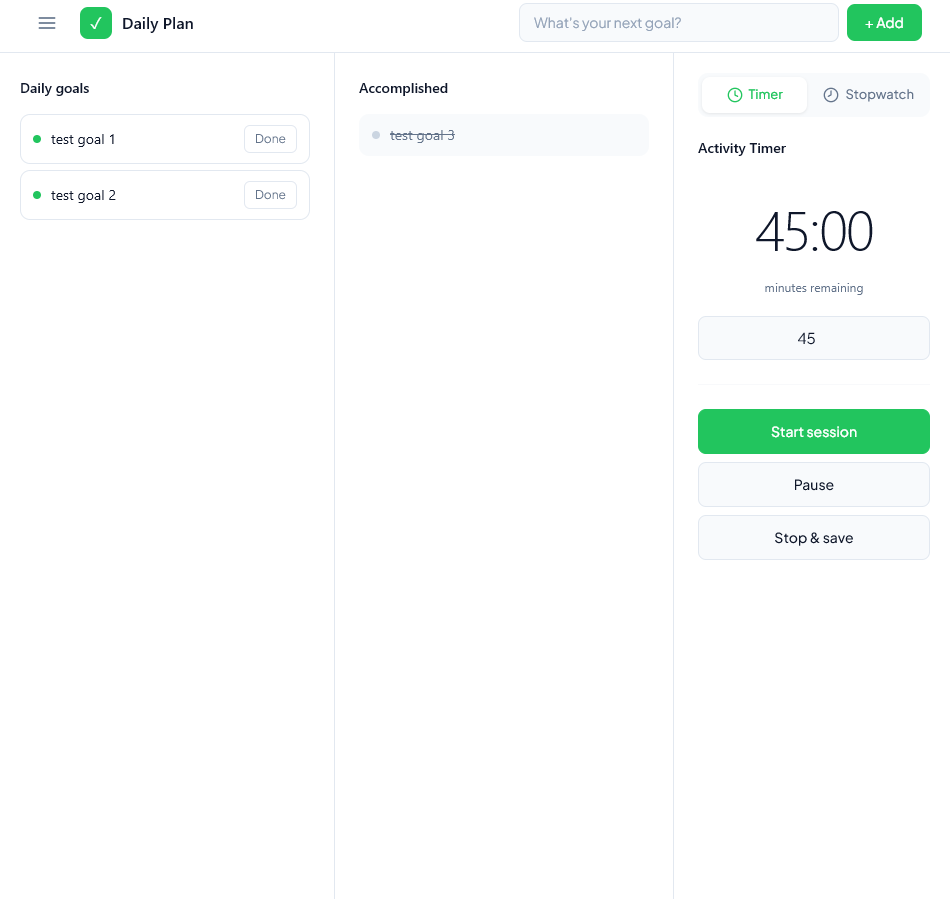

# 🎯 Daily Plan

A personal productivity web application for tracking daily goals, activities, and progress with automated statistics collection and Telegram reporting.

🔗 [http://194.33.35.224:8080/daily/main](http://194.33.35.224:8080/daily/main)
📖 [API Documentation (Swagger)](http://194.33.35.224:8080/swagger-ui/index.html)

---

## 📖 About the Project
Daily Plan is a full-stack web application designed to help users track their daily routines, manage goals, and analyze their productivity. Unlike standard CRUD applications, this project features a real domain logic with background processing, external API integration, and automated data analytics.

The core idea is to provide a hands-free tracking experience: users set goals and use a built-in timer to log activities, while the backend automatically aggregates statistics, cleans up outdated data, and sends formatted progress reports directly to the user's Telegram.

---

## ✨ Features

### 📊 Goal & Activity Tracking
*   **Interactive Timer:** Track time spent on specific activities with a built-in web timer.
*   **Goal Management:** Set daily/weekly goals and track completion status.
*   **Domain-Driven Logic:** Real-world entity relationships (User, Goals, Activities, Timer, Statistics, Settings).

### 🤖 Telegram Integration & Reporting
*   **Automated Reports:** Scheduled daily and weekly progress reports sent via Telegram Bot API.
*   **External API Handling:** Secure integration with external services, keeping API calls out of the controller layer.

### ⚙️ Background Processing & Analytics
*   **Scheduled Jobs (`@Scheduled`):** Automated creation of default goals, daily/weekly tasks, database cleanup (data-retention policy), and statistics aggregation.
*   **Async Execution (`@Async`):** Non-blocking processing for heavy analytical tasks.
*   **Separate Stats Storage:** Dedicated schema for storing aggregated analytics to optimize read performance.

### 🛡️ Security & Infrastructure
*   **Spring Security:** Role-based access control, `UserDetails`, and secure password encoding (`PasswordEncoder`).
*   **Database Migrations:** Version-controlled schema management using **Flyway** (no `ddl-auto` in production).
*   **Monitoring & Docs:** Spring Actuator for health checks and OpenAPI (Swagger) for interactive API documentation.

---

## 🏗️ How It Works
1.  **User Interaction:** The user authenticates, sets goals, and starts the activity timer via the Thymeleaf/JS frontend.
2.  **Data Persistence:** Timer events and goal completions are saved to PostgreSQL within managed Spring transactions (`@Transactional`).
3.  **Background Analytics:** Scheduled background jobs aggregate raw timer data into a separate `stats_storage` for fast analytical queries.
4.  **Automated Reporting:** The system triggers the Telegram Bot to send formatted weekly/daily reports to the user's chat.
5.  **Data Retention:** An automated daily cleanup job removes outdated historical data to keep the database lightweight.

---

## 🛠️ Tech Stack

| Layer | Technology |
| --- | --- |
| **Backend** | Java 21, Spring Boot, Spring Security, Spring Data JPA |
| **Database** | PostgreSQL, Flyway (Migrations) |
| **Frontend** | Thymeleaf, HTML5, CSS3, JavaScript |
| **Integrations** | Telegram Bot API, OpenAPI (Swagger), Spring Actuator |
| **Utilities** | MapStruct, Lombok, Logback |
| **DevOps** | Docker, Docker Compose, Environment Variables |
| **Testing** | JUnit, AssertJ, Testcontainers, JaCoCo |

---

## 🔮 Roadmap

### ✅ Current State
*   Full user authentication and role management.
*   Activity tracking via timer and goal management.
*   Automated Telegram reporting and background statistics aggregation.
*   Dockerized deployment with `docker-compose` and health checks.

### 🚧 Planned
*   **Architecture Refactoring:** Transition `Activity` from a string-based identifier to a dedicated `Activity` entity with immutable `UUID` to preserve historical data integrity.
*   **Test Coverage:** Implement comprehensive integration tests using **Testcontainers** and **PostgreSQL Testcontainers** for repositories and services.
*   **CI/CD Pipeline:** Set up **GitHub Actions** for automated testing, building, and Docker image deployment on `git push`.
*   **Configuration Externalization:** Move hardcoded settings (like `ZoneId`) to externalized `application.yml` properties for better multi-environment support.

---

## 📸 Screenshots

<p align="center">
 
 
 
 
 
</p>

---

## 📦 Local Setup

### 1. Clone the repository
```
git clone https://github.com/kv3rk/daily-plan.git
cd daily-plan
```
### 2. Configure Environment Variables
```
USER_LOGIN=your_login
USER_PASSWORD=your_password
TELEGRAM_BOT_USERNAME=your_bot_username
TELEGRAM_BOT_TOKEN=your_bot_token
TELEGRAM_BOT_CHAT_ID=your_chat_id
```
### 3. Run the application
```
docker compose up --build
```
---

<div align="center">
<i>Built with ❤️ for personal productivity and backend engineering practice</i>
</div>