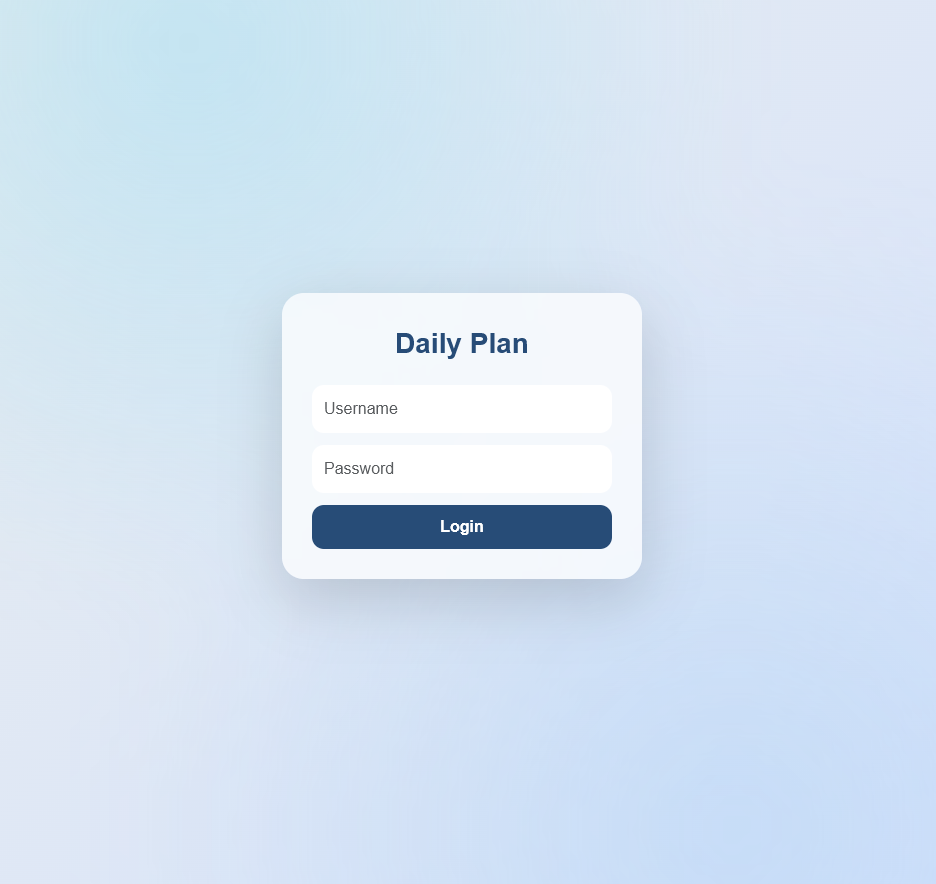
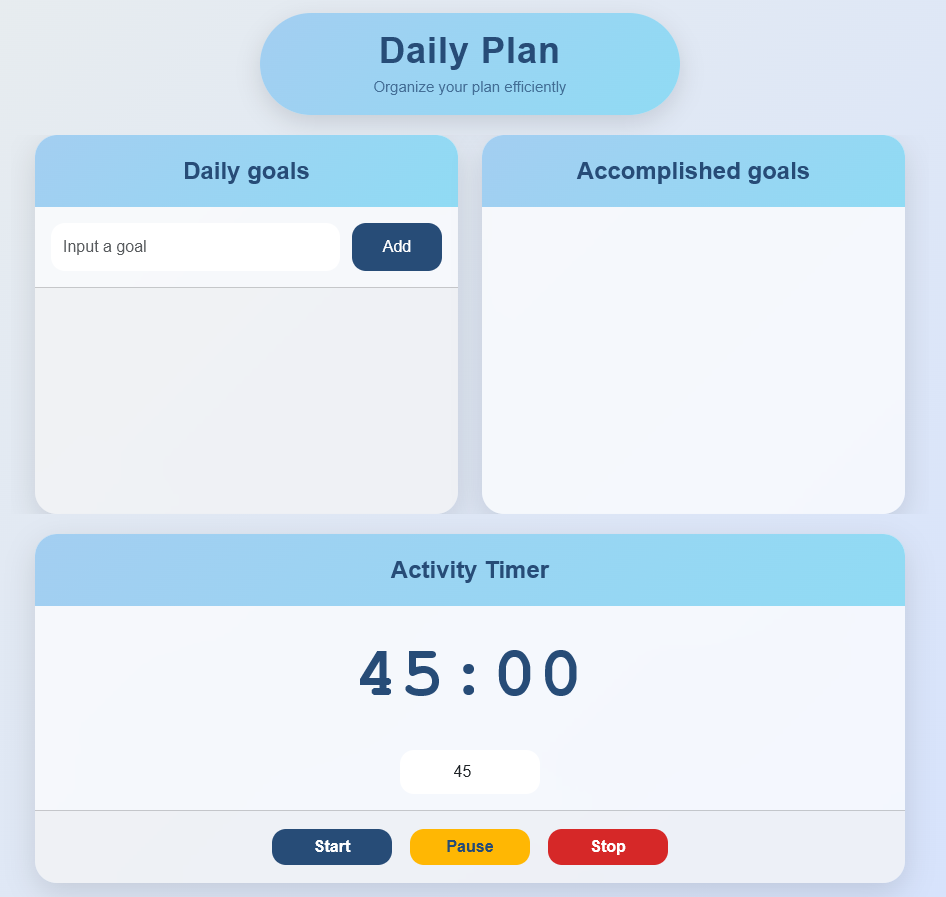
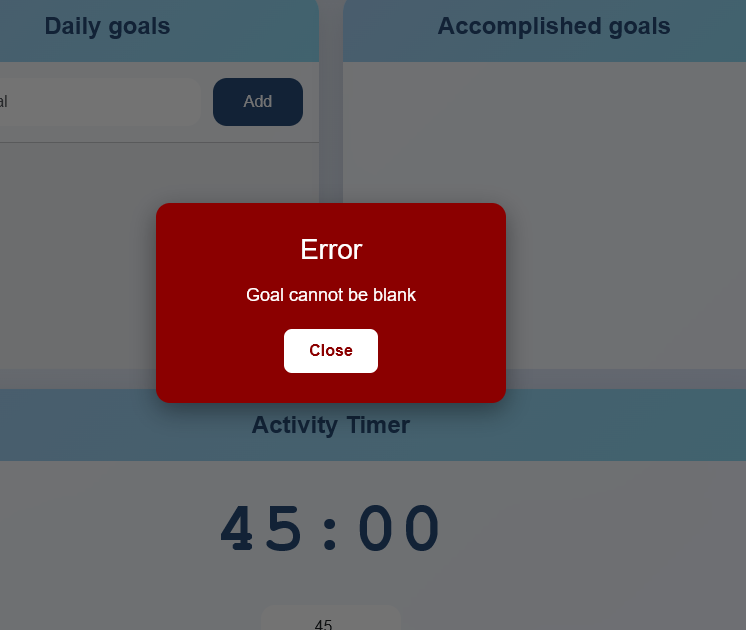
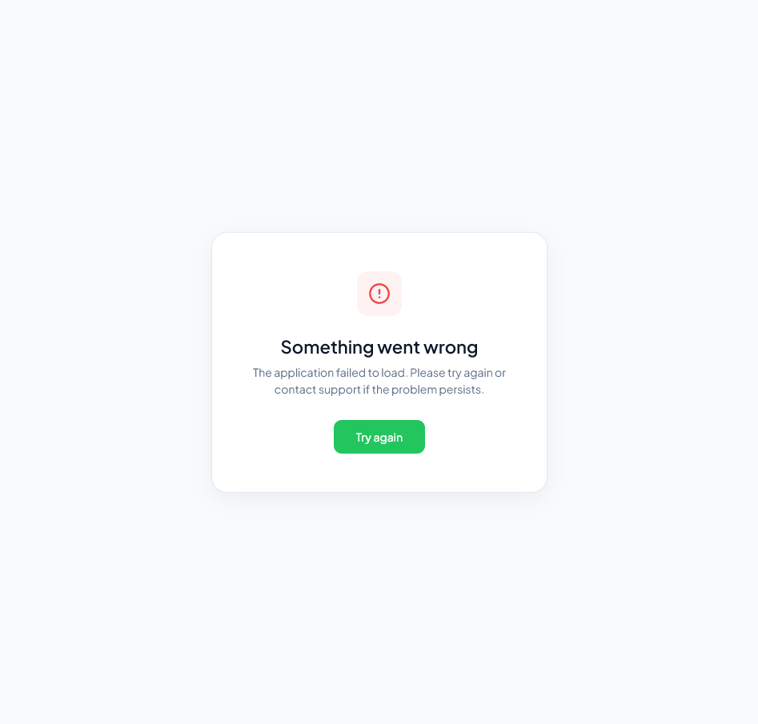
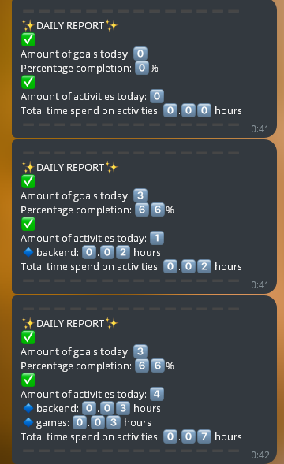

## DailyActivity

Web application for tracking daily tasks and activities with automatic statistics collection and Telegram integration.

The project is developed for personal use and allows tracking goal completion, recording activities via a timer, and receiving automated progress reports.

## Tech Stack

* Java 21
* Spring Boot
* Spring Security
* Spring Data JPA
* PostgreSQL
* Flyway
* Thymeleaf
* Docker
* Telegram Bot API
* OpenAPI (Swagger)

## Screenshots

  
  
  
  
  
   

## API Documentation

Swagger
http://194.33.35.224:8080/swagger-ui/index.html

## Running project
1. Clone repository
   
3. Create .env file
   
   * USER_LOGIN=your_login
   * USER_PASSWORD=your_password
   * TELEGRAM_BOT_USERNAME=your_bot_username
   * TELEGRAM_BOT_TOKEN=your_bot_token
   * TELEGRAM_BOT_CHAT_ID=your_chat_id
   
4. Start application
   
   docker compose up --build

5. Open URL

## URL

http://194.33.35.224:8080/daily/main
